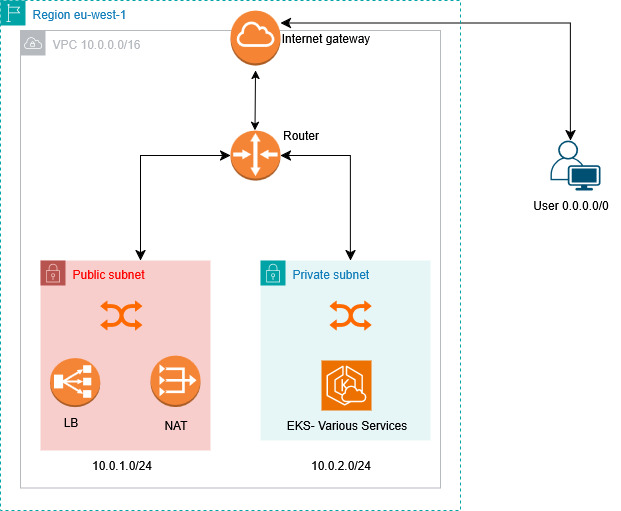
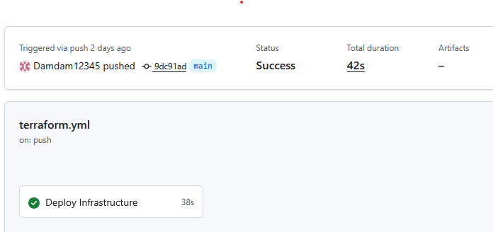

## Architecture Overview

The InnovateMart retail store application is deployed on Amazon EKS with the following architecture:

### Core Components
- **EKS Cluster**: Kubernetes v1.32 with managed node groups
- **Node**: one t3.medium
- **VPC**: Multi-AZ with public and private subnets
- **Application**: Microservices architecture with 6 services
- **Storage**: In-cluster databases (MySQL, PostgreSQL, DynamoDB Local)
- **Load Balancing**: Kubernetes LoadBalancer service

### Application URL
- **Development**: http://a47cccc02a31c46038f6a65c08d71c39-1944931922.eu-west-1.elb.amazonaws.com/

### Services
- **UI Service**: Main application interface (Port 80)
- **Catalog Service**: Product catalog (Port 8080)
- **Cart Service**: Shopping cart functionality (Port 8080)
- **Orders Service**: Order processing (Port 8080)
- **Checkout Service**: Payment processing (Port 8080)
- **Assets Service**: Static assets (Port 8080)

### Scaling
- **Horizontal**: Add more pod replicas during high traffic

# Developer Access Instructions - InnovateMart EKS Cluster

## AWS Credentials
**Access Key ID:** $(terraform output -raw developer_access_key_id 2>/dev/null || echo "[Get from terraform output developer_access_key_id]")
**Secret Access Key:** $(terraform output -raw developer_secret_access_key 2>/dev/null || echo "[Get from terraform output -raw developer_secret_access_key]")
**Region:** eu-west-1

## Setup Steps

### 1. Configure AWS CLI
\`\`\`bash
aws configure
# Enter the Access Key ID and Secret Access Key above
# Region: eu-west-1
# Output format: json
\`\`\`

### 2. Configure kubectl
\`\`\`bash
aws eks update-kubeconfig --region eu-west-1 --name innovatemart-eks
\`\`\`

### 3. Verify Access
\`\`\`bash
# Test connection
kubectl get nodes

# View application pods
kubectl get pods

# Check services
kubectl get services
\`\`\`

## Available Commands (Read-Only Access)
- View pods: \`kubectl get pods\`
- Check logs: \`kubectl logs <pod-name>\`
- Describe resources: \`kubectl describe pod <pod-name>\`
- View services: \`kubectl get services\`
- Port forwarding: \`kubectl port-forward svc/ui 8080:80\`

## Application Access
**Application URL:** $(kubectl get svc ui -o jsonpath='{.status.loadBalancer.ingress[0].hostname}' 2>/dev/null || echo "[Get from: kubectl get svc ui]")

## Troubleshooting
- If "access denied": Verify AWS credentials are correct
- If "no resources found": Ensure you're in the right region (eu-west-1)
- If pods not visible: Check that kubectl context is set correctly

# GitHub Actions Automation 

## Workflow Status
-  GitHub Actions workflow configured
-  Terraform init successful
-  Terraform plan successful  
-  Terraform apply successful
-  Infrastructure deployed via automation

## Proof
- Check GitHub Actions tab for successful workflow runs
- Last successful deployment: September 20,2025
- Resources deployed: EKS cluster, VPC, IAM roles, etc.
- 

## Workflow Triggers
- Pushes to main branch with terraform changes
- Pull requests to main branch
- Automatic terraform apply on main branch merges